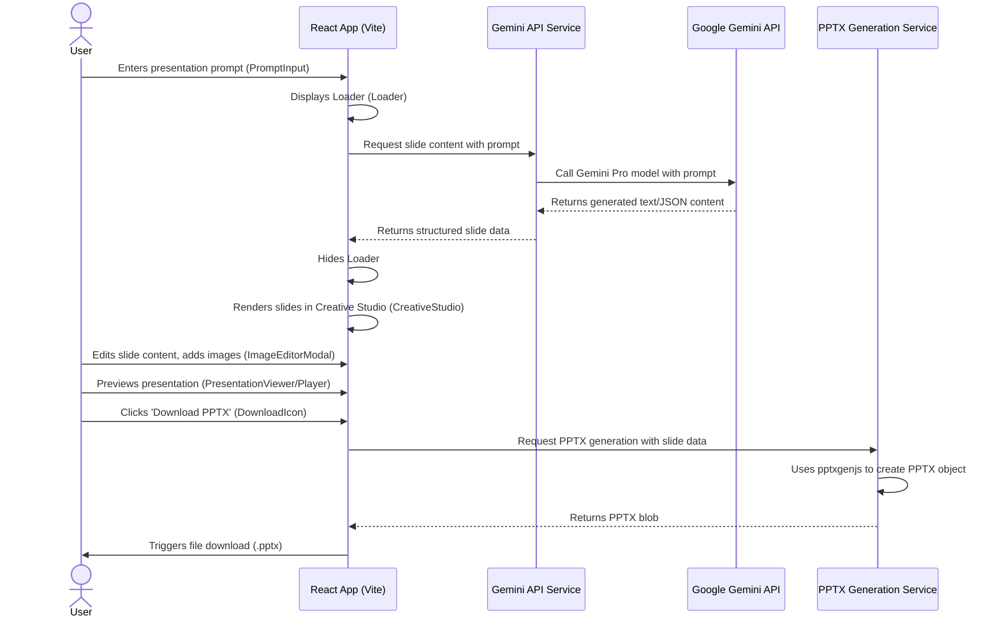

<div align="center">

  <br/>
  <h1>✨ AI-Powered Presentation Maker ✨</h1>

  <p>Craft compelling presentations effortlessly with AI.</p>

  <p>
    
    
    
    
    
  </p>
</div>

## 📝 Description

**ppt-ai-maker** is an innovative AI Studio application designed to revolutionize presentation creation. Leveraging the power of Google Gemini, this tool allows users to generate professional and engaging presentations from simple text prompts. It provides a comprehensive creative workspace for real-time slide editing, image management, and seamless export to standard PPTX format. Say goodbye to manual slide creation and embrace an intelligent, efficient workflow.

View your app in AI Studio: [https://ai.studio/apps/drive/1sY2rep-rWSK1ETe0Z8X_IK5GBubqBVoJ](https://ai.studio/apps/drive/1sY2rep-rWSK1ETe0Z8X_IK5GBubqBVoJ)

## 🌟 Key Features

*   🧠 **AI-Powered Generation**: Instantly generate multi-slide presentations from natural language prompts using Google Gemini.
*   ✏️ **Creative Studio**: A dedicated workspace (`components/CreativeStudio.tsx`) for intuitive, real-time editing of slide content, layouts, and designs.
*   🖼️ **Integrated Image Editor**: Enhance your presentations with easy image uploads, cropping, and adjustments via `components/ImageEditorModal.tsx`.
*   ▶️ **Presentation Playback**: Preview your slides in a dynamic player before final export using `components/PresentationPlayer.tsx`.
*   ⬇️ **PPTX Export**: Download your AI-generated and edited presentations as standard Microsoft PowerPoint (`.pptx`) files.
*   🎨 **Interactive UI**: A smooth and responsive user interface built with React and animated with Framer Motion.
*   ⚙️ **Modular Design**: Clean and maintainable codebase structured with reusable components and dedicated services.

## 🚀 Tech Stack

This project is built with a modern web development stack:

*   **Frontend Framework**: [React](https://react.dev/) (v18.2.0) - A declarative, component-based JavaScript library for building user interfaces.
*   **Language**: [TypeScript](https://www.typescriptlang.org/) (v5.x) - A superset of JavaScript that adds static typing.
*   **Build Tool**: [Vite](https://vitejs.dev/) (v6.2.0) - A fast build tool and development server for modern web projects.
*   **AI Integration**: [@google/genai](https://www.npmjs.com/package/@google/genai) (v1.28.0) - Official SDK for interacting with Google Gemini API.
*   **PPTX Generation**: [pptxgenjs](https://gitbrent.github.io/PptxGenJS/) (v3.12.0) - A JavaScript library to create PowerPoint presentations.
*   **Animations**: [Framer Motion](https://www.framer.com/motion/) (v11.3.11) - A production-ready motion library for React.
*   **Development Environment**: Node.js & npm

## ⚙️ Installation

To get this project up and running on your local machine, follow these steps:

### Prerequisites

Ensure you have [Node.js](https://nodejs.org/) (which includes npm) installed on your system.

### Local Setup

1.  **Clone the repository:**
    ```bash
    git clone https://github.com/your-username/ppt-ai-maker.git
    cd ppt-ai-maker
    ```

2.  **Install dependencies:**
    ```bash
    npm install
    ```

3.  **Configure API Key:**
    Create a `.env.local` file in the root of the project and add your Google Gemini API key:
    ```
    GEMINI_API_KEY=YOUR_GEMINI_API_KEY_HERE
    ```
    You can obtain a Gemini API key from [Google AI Studio](https://ai.google.dev/).

4.  **Run the application:**
    ```bash
    npm run dev
    ```
    The application will typically be available at `http://localhost:5173` (or another port if 5173 is in use).

## 💡 Usage

1.  **Launch the Application**: Once the app is running locally, navigate to the provided URL in your browser.
2.  **Enter Your Prompt**: Use the input field (`components/PromptInput.tsx`) to describe the presentation you want to create (e.g., "Create a presentation about sustainable energy sources for a high school audience.").
3.  **Generate Slides**: Click the "Generate" button to send your prompt to the Gemini AI, which will create the initial slides.
4.  **Edit and Refine**: The generated slides will appear in the Creative Studio. Click on individual slides or elements to edit text, add/remove images, or adjust layouts.
5.  **Preview Presentation**: Use the built-in player (`components/PresentationPlayer.tsx`) to review your presentation flow.
6.  **Download PPTX**: Once satisfied, click the download icon to save your complete presentation as a `.pptx` file.

## 📖 API Reference

This application integrates with the Google Gemini API to power its AI generation capabilities. The core logic for this interaction is encapsulated within `services/geminiService.ts`.

### Google Gemini API

*   **Purpose**: Used for generating textual content, summarizing information, and structuring initial slide outlines based on user prompts.
*   **Authentication**: Requires a `GEMINI_API_KEY` which must be set as an environment variable (`.env.local`).
*   **Endpoint**: Interacts with the Gemini family of models (e.g., `gemini-pro`).
*   **Usage in `geminiService.ts`**: Handles prompt submission, response parsing, and error handling for AI-driven content creation.

No public-facing API is exposed by this application itself.

## 🏛️ Architecture

The following diagram illustrates the high-level flow of user interaction and data within the ppt-ai-maker application:



## 🤝 Contributing

We welcome contributions to the **ppt-ai-maker** project! If you have suggestions, bug reports, or want to contribute code, please follow these steps:

1.  **Fork** the repository.
2.  **Create a new branch** for your feature or bug fix (`git checkout -b feature/your-feature-name`).
3.  **Make your changes** and ensure they adhere to the project's coding standards.
4.  **Commit your changes** with a clear and descriptive commit message.
5.  **Push your branch** to your forked repository.
6.  **Open a Pull Request** to the `main` branch of this repository, describing your changes in detail.

## 📜 License

This project is licensed under the MIT License - see the [LICENSE](LICENSE) file for details.

## 📝 Changelog

For a detailed list of changes in each version, please refer to the sections below.

## 🛣️ Roadmap

Our future plans for **ppt-ai-maker** include enhancing its capabilities and user experience:

*   **Advanced Layouts & Themes**: Implement more sophisticated slide templates and customizable themes.
*   **Image Generation Integration**: Integrate with AI image generation APIs (e.g., DALL-E, Midjourney) for automated image suggestions.
*   **Real-time Collaboration**: Enable multiple users to work on the same presentation simultaneously.
*   **Cloud Storage Integration**: Support saving and loading presentations from cloud services (e.g., Google Drive, Dropbox).
*   **Multi-language Support**: Extend AI generation and UI to support various languages.
*   **Rich Media Embedding**: Allow embedding videos and interactive elements within slides.
*   **Accessibility Improvements**: Ensure the application is usable by individuals with diverse needs.
*   **Unit & E2E Testing**: Implement a comprehensive testing suite to ensure stability and reliability.
